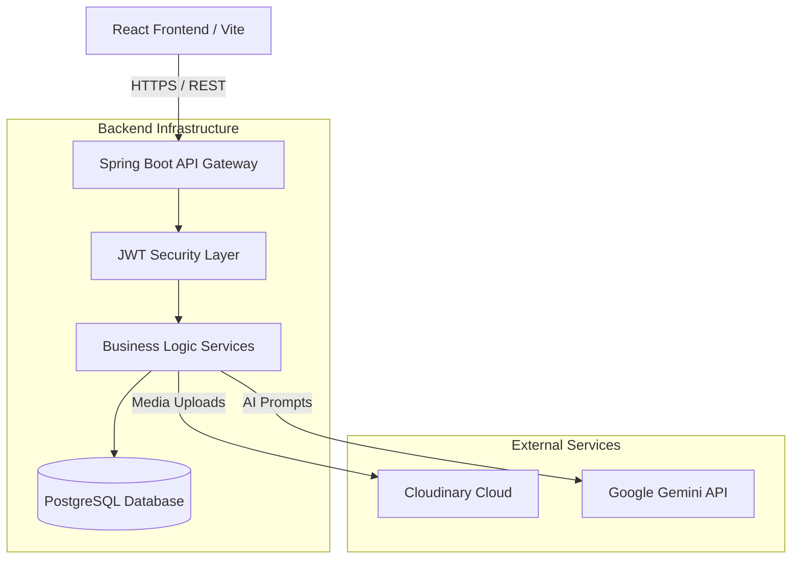
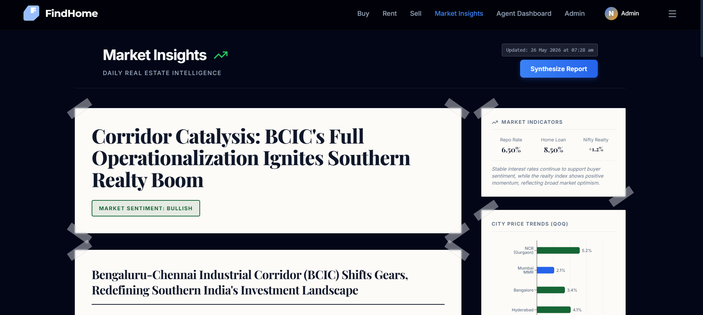
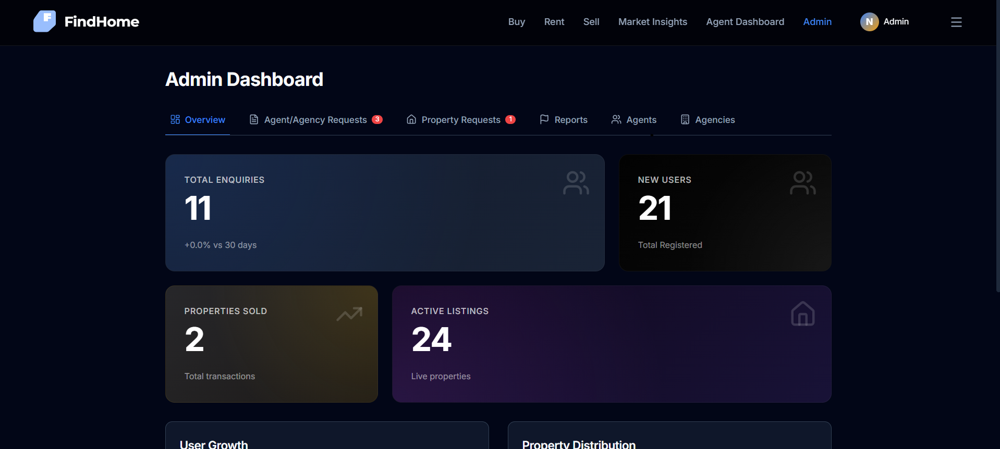
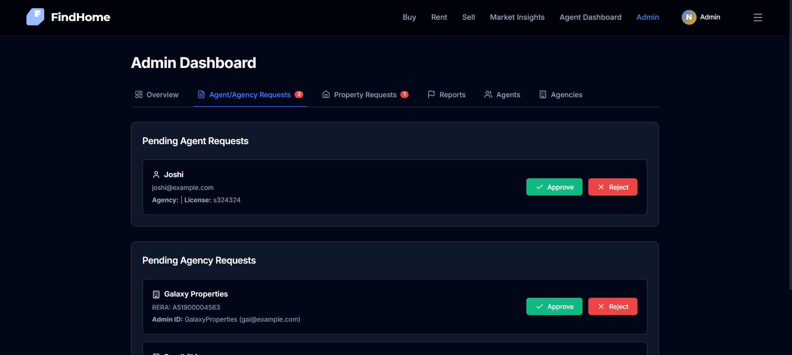

# 🏡 FindHomeJ - Next-Gen Real Estate Platform

> **Note:** This repository serves as an architectural showcase and documentation hub for **FindHomeJ**. The core application source code is maintained in a private repository to protect proprietary API orchestrations, custom AI prompts, and security implementations.

**[🚀 View Live Project Here](#)** *(https://find-home-realty.vercel.app/)*

---

## 📖 Overview

FindHomeJ is a comprehensive, full-stack real estate platform designed to modernize the property search experience. Going beyond standard CRUD operations, it integrates advanced LLM orchestration (Google Gemini API) to provide intelligent property insights, automated image processing via Cloudinary, and a robust Role-Based Access Control (RBAC) system for administrators and standard users.

## ✨ Core Features

*   **🧠 AI-Powered Insights:** Leverages the Google Gemini API to analyze property details and generate intelligent summaries and recommendations for buyers.
*   **🏢 Robust Property Management:** End-to-end lifecycle management for listings, powered by a Spring Boot backend and PostgreSQL.
*   **🖼️ Automated Media Handling:** Seamless integration with Cloudinary for optimized, secure image uploads and delivery.
*   **🛡️ Enterprise-Grade Security:** Comprehensive JWT-based authentication coupled with strict Role-Based Access Control (RBAC).
*   **🚦 Intelligent Rate Limiting:** Custom global rate limiters implemented to protect AI API endpoints and ensure system stability.

## 📐 System Architecture

The application is built on a decoupled architecture, ensuring scalability and clear separation of concerns.

## 🛠️ Technical Stack

### Frontend
*   **Framework:** React (Vite)
*   **Styling:** Modern CSS / Context API for state management
*   **Routing:** React Router

### Backend
*   **Framework:** Java / Spring Boot 3
*   **Database:** PostgreSQL with Hibernate/JPA
*   **Security:** Spring Security + JWT
*   **External APIs:** Google Gemini (AI Insights), Cloudinary (Media)
*   **Cloud:** Render(Backend), Vercel(frontend), NeonDB(Serveless PostgesSQL DB)

## 📸 Application Showcase

*(Replace the placeholder image links below with actual screenshots of your app placed in your `assets/` folder)*

### AI Property Neighborhood Insights
> Demonstrating the Gemini API orchestration to provide users with intelligent market context.

### AI Makrtet Insights
> Demonstrating the Gemini API orchestration to provide users with intelligent market context.

### Property Exploration
> A highly optimized frontend consuming REST APIs for real-time property discovery.

### Admin Dashboard 
> Secure RBAC dashboard for managing global settings, rate limits, and users.

### Admin Dashboard Property Listing Requests
> Secure RBAC dashboard for managing global settings, rate limits, and users.

## 💡 Engineering Impact & Highlights

*   **API Orchestration & Efficiency:** Designed a custom wrapper around the Gemini API, utilizing global rate limiting algorithms (`GlobalGeminiRateLimiter`) to prevent quota exhaustion while maintaining sub-second response times for users.
*   **Secure Content Delivery:** Architected a seamless pipeline between the frontend client and Cloudinary, offloading heavy media processing from the primary Spring Boot server, resulting in faster load times.
*   **Scalable Authorization:** Implemented stateless session management using JWTs, ensuring that administrative endpoints and sensitive user data remain protected behind strict validation layers.

---
*If you are a recruiter or engineer interested in discussing the technical implementation details, please feel free to reach out via my [LinkedIn/Portfolio].*
